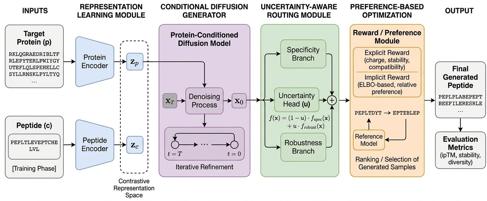

# PepGUIDE

Final implementation of **PepGUIDE**, built on top of PepCCD for target-specific peptide generation.

This repository contains:

- the final PRIME-aligned PPO training pipeline for diffusion
- uncertainty-aware routing (UR)
- reproducibility notes for end-to-end training reruns

For the full reproduction workflow, see [REPRODUCIBILITY.md](./REPRODUCIBILITY.md).



## Environment Setup

```bash
conda env create -f environment.yml
conda activate PepCCD
```

## Required Assets

### 1) ESM-2 Protein Language Model

Download `facebook/esm2_t30_150M_UR50D` from Hugging Face:

- https://huggingface.co/facebook/esm2_t30_150M_UR50D

Place the full model folder at:

- `./checkpoints/ESM/`

### 2) PepCCD/PepGUIDE Checkpoints

Original PepCCD resources are available at:

- https://huggingface.co/ZhouYyang/PepCCD/tree/main

Create directories:

```bash
mkdir -p ./checkpoints/Align
mkdir -p ./checkpoints/Fine_Diffusion
```

Then place:

- `best_pep.pth` and `best_prot.pth` into `./checkpoints/Align/`
- diffusion checkpoint(s) into `./checkpoints/Fine_Diffusion/`

### 3) Pre-training Dataset

From the same Hugging Face page above, prepare:

```bash
mkdir -p ./dataset/Pre_Diffusion
```

Place the pre-training sequence file in:

- `./dataset/Pre_Diffusion/`

## Quick Start (Training Only)

Run the final PRIME-aligned PPO training pipeline:

```bash
bash ./experiments/run_sota_candidate_prime_ppo.sh
```

Main outputs after training:

- checkpoints in `./checkpoints/UR_PepCCD_MoE/`


## Notes

- The final RL path is in `./train/rl_finetune_ppo.py`.
- Public reproduction in this repository focuses on training only.


